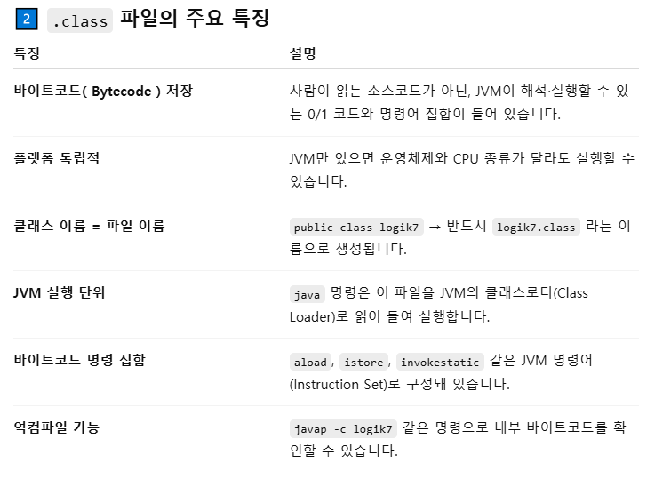

# 핵심 키워드
 

### 자동타입변환
    값의 허용 범위가 작은타입 -> 큰 타입으로 '자동변환'
    byte > short < int < long < float > double
    * byte(-128 ~ +127)는 음수를 포함하고 있어 char(0~65535)보다 허용범위가 작아도
      자동변환이 일어나지 않는다 

 

### 강제타입변환 (캐스팅 casting)
    저장범위가 큰 타입을 작은 타입으로 강제로 나눠서 저장
    실수 타입(float, double)은 정수타입(byte, short, int, long)으로 변환 시 소수점은 버려지고 정수만 저장
    작은타입 = (작은타입) 큰타입 
    (ex : int result = (int) (var1 + var2); var1, var2는 double)
 

### 문자열 결합 연산
    문자열 + 연산 = 다른 피연산자도 문자열로 변환 
 

### integer.parselnt()
    문자열을 정수 int 타입으로 변환
 

### Double.parseDouble()
    문자열을 실수double로 변환
 
 

# 확인문제

### 1. 자동 타입 변환의 컴파일 에러 이유 
    | byte byteValue = 10; 
    | char charValue = 'A'; 

    자동 타입 변환 = 작은 타입 -> 큰 타입으로 자동 변환
    - int intValue1 = byteValue; int(+-21억) > byte(+-128)
    - int intValue2 = charValue; int(+-21억) > char(3만)
    - short shortValue = charValue; short(+-3만) < char(6만) -> 자동 타입 변환 시 컴파일 에러
    - double doubleValue = byteValue; double(1.8 × 10³⁰⁸) > byte(+-128)

 

### 2. 강제 타입 변환 컴파일 에러 이유 
    | int intValue = 10; 
    | char charValue = 'A'; 
    | double doubleValue =5.7; 
    | String strValue ="A"; 

    강제 타입 변환 = 큰 타입 -> 작은 타입
    - double var1 = (double) intValue; -> double > int 
        정수에서 실수로 변환
    - byte var2 = (byte) intValue; -> int > byte
    - int var3 = (int) doubleValue; -> double > int
        실수에서 정수변환, 수소점 날아감
    - char var4 = (char)strValue; -> srt=String=문자열 char
        숫자를 문자열로 String.valueOf() 강제변환할 수 있음
        문자열을 숫자로 강제 캐스팅은 불가
        charAt() 또는 toCharArray() 로 문자 단위로 꺼내야 함

         
 

### 3. 연산식에서 타입 변환 컴파일 에러 
    | byte byteValue = 10; 
    | float floatValue = 2.5F; 
    | double doubleValue = 2.5; 

    에러 이유 = 결과가 int로 나와 강제 타입 변환되어 cannot convert 에러창이 뜬다

     
 

### 4. 컴파일 에러 발생하는 위치, 이유 
    | short s1= 1; 
    | short s2 = 2; 
    | int i1 = 3; 
    | int i2 = 4; 
    | short result = s1 + s2; 
    | int result = i1 + i2; 

    에러 이유 = 연산의 결과는 int 타입으로 강제 변환 타입에 해당

 

### 5. a 유니코드 = 97, b 유니코드 = 98, 실행결과 b 나와야 하는 데 컴파일 에러 
    | char c1 = 'a'; 
    | char c2 = c1 + 1; 
    | System.out.println(c2); 
    에러 이유 = char c2 = c1 + 1;의 결과가 int로, 강제 변환 코드가 아니라서 오류

     
 

### 6. 자바 나눗셈 연산자 '/', ( )안에 들어갈 타입, 출력의 결과와 이유 
    | int x = 5; 
    | int y = 2; 
    | (      ) result = x/y; 
    | System.out.println(result); 

    * 해당 실행파일의 class 파일 생성 이유 *

    - javac logic6.java(logic6.java파일을 기계어로 번역) 명령이 
        자바 소스(.java)를 JVM이 이해할 수 있는 바이트코드로 변환해 
        logic6.class를 만든다

    - OS에 독립적이다
        Windows, macOS, Linux 어디서든 같은 .class 파일을 JVM이 실행할 수 있다 

     
 

### 7. 6번 문제 결과가 2.5로 나오도록 () 코드작성 
    | int x = 5; 
    | int y = 2; 
    | (      ) result = (      ); 
    | System.out.println(result); 

     
 

### 8.  두 실수 연산 후 소수점 이하 버리기 () 코드작성 
    | double var1 = 3.5; 
    | double var2 = 2.7; 
    | int result = 3.5+2.7; 

     
 

### 9. var1부터 var4까지 연산 수행, int 변수 result에 9가 저장되도록
    | long var1 = 2L; 
    | float var2 = 1.8f; 
    | double var3 = 2.5; 
    | String var4 = "3.9"; 
    | int result = (       ); 
    | System.out.prinln(result); 

    
 

### 10. 코드 실행의 결과
    | String str1 = 2 + 3 + ""; 
    | String str2 = 2 + "" + 3; 
    | String str3 = "" + 2 + 3; 
    | System.out.println(str1); 
    | System.out.println(str2); 
    | System.out.println(str3); 

    str1 -> 2 + 3 + "" -> 5 + "" -> 5
    str2 -> 2 + "" + 3 -> "2"+3 -> 23
    str3 -> "" + 2 + 3 -> "2" + 3 -> 23

    String연산은 왼쪽부터 차례대로 합체
    2 + "", "" + 2이 합체하면서 문자열로 바뀜
    위 식의 결과에서 23은 2(문자)3(숫자)이다

    
 

### 11. 문자열을 기본타입으로 변환하기 위해 () 채우기
    | byte value = (            )("10"); 
    | int value = (            )("1000"); 
    | float value = (            )("20.5"); 
    | double value = (            )("3.14159"); 

