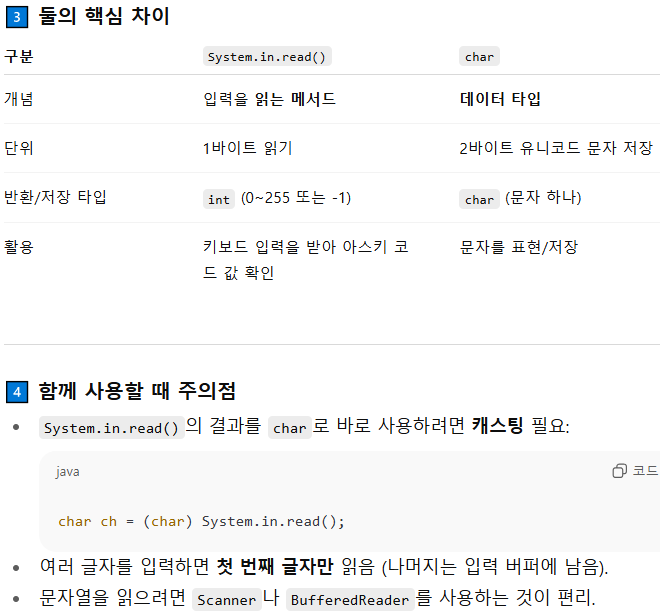

# 핵심 키워드

### System.out.println()
    괄호 안 매개값을 모니터로 출력 & 개행(줄바꿈)

### System.out.print()
    괄호 안 매개값을 모니터로 출력만 하기

### System.out.printf()
    괄호 안 형식 그대로 출력

### System.in.read()
    - 키보드에서 입력된 키코드 하나 읽음
        => 2개 이상의 키 조합인 한글을 읽을 수 없다.
    - 입력한 내용 전체를 문자열로 읽을려면 Scanner써야함

    -> char와 차이점 

        - System.in.read()는 메서드
          2바이트 이상의 조합인 한글은 읽을 수 없다

        - char : 유니코드 한 글자를 저장하는 자료형 
          → 직접 키보드를 읽지 않으며, 입력된 값을 저장·표현할 때 사용.

 
 

# 확인 문제

1. `java` 

2. `java`

3. `java`

