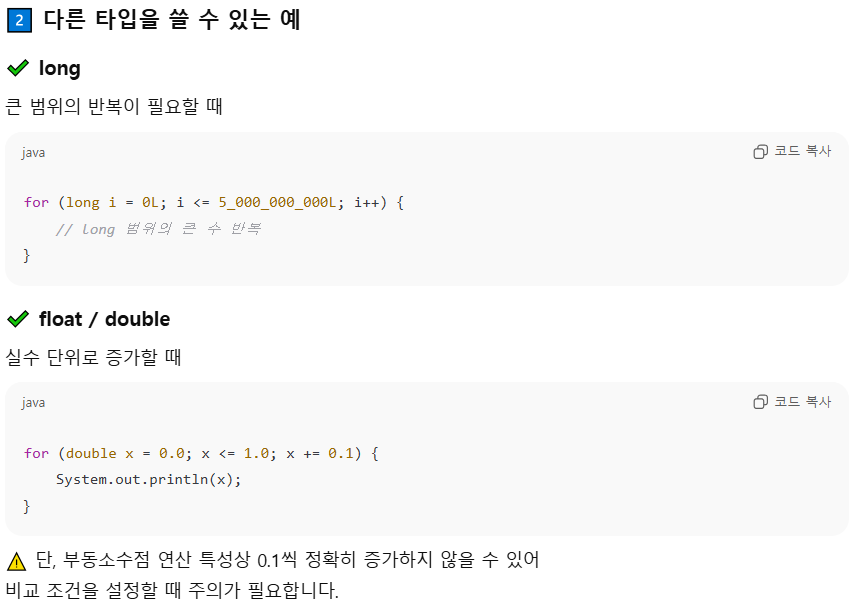
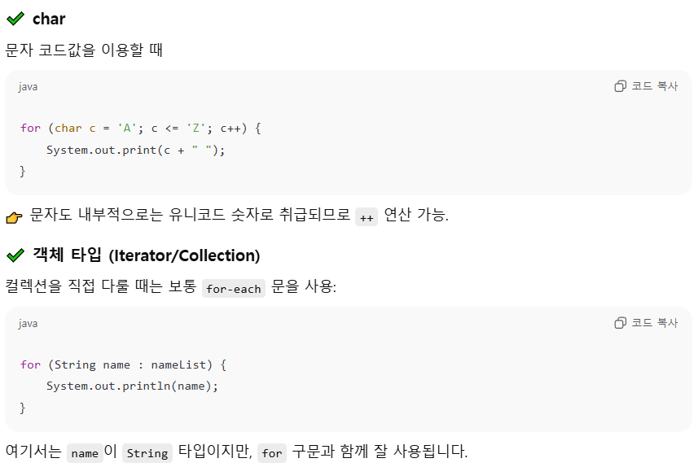

# 핵심 포인트

 
 

### 0. 반복문의 종류
    for while do-while (break로 반복문 종료)
 

### 1. for문 
    똑같은 실행문을 반복 작업할 때, 정해진 횟수만큼 반복

    for (초기화식; 조건식; 증감식)
        i=0; i=-200; i--

    int sum = 0;
    for (int i=1; i<=100; i++) {  ->  i는 int, i는 1부터 시작, i가 100보다 작거나 같아질 때까지 실행, i를 1씩 증가하기
        sum = sum + i;
    }
    System.out.println("1~100의 합:"+ sum);

 

### 2. while문 
    조건식이 true면 계속 반복, false면 while문 종료
    
    변수 선언;
    while (조건식) {
        실행문 내용;
    }

    int i =1;
    while (i<=10) {
        System.out.println(i);
        i++;
    }
 

### 3. do-while문
    결과에 따라 실행을 계속할지 멈출지 결정 

    do {
        실행문;
    } while (조건식);
 

### 3. break문  <---->  continue문

  

# 4. 확인 문제

### 1. 반복문의 종류
    for / while / do-while
 

### 2. for문을 이용해서 1~100까지 정수 중 3의 배수의 총합을 구하는 코드 작성

 

### 3. while문과 Math.random() 메소드를 이용해서 2개 주사위를 던졌을 때 나오는 눈을 (눈1, 눈2)로 출력하고, 눈의 합이 5가 될 떄까지 실행하는 코드 작성

 

### 4. 중첩 for문을 이용하여 방정식 4x+5y=60의 모든 해를 구해서 (x, y)형태로 출력. 단 x, y는 10 이하 자연수

 

### 5. for문을 이용해서 다음과 같이 출력
    *
    **
    ***
    ****

 

### 6. for문을 이용해서 다음과 같이 출력
       *
      **
     ***
    ****     

### 7. while문과 Sacnner를 이용해서 예금, 출금, 조회, 종료 코드 작성. Scanner의 NextLine()사용

실행결과 

| 선택항목 | 1.예금 | 2. 출금 | 3. 잔고 | 4. 종료 |
|:----:|:----:|:----:|:----:|:----:|
| 1 |예금액>10000 |   |
| 2 || 출금액>10000  |
| 3 ||| 잔고>10000 ||
| 4 ||||프로그램 종료|

